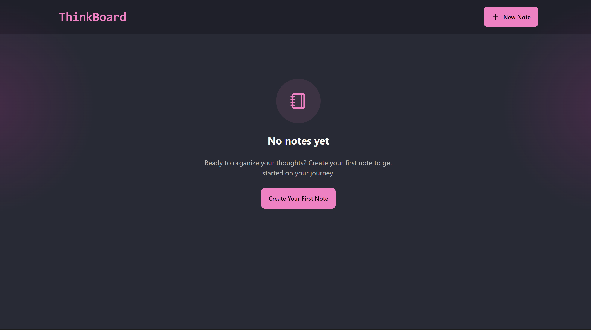

# 📝 ThinkBoard

ThinkBoard is a full-stack MERN (MongoDB, Express, React, Node.js) application that allows users to create, manage, and delete personal notes.
It features a clean UI, rate limiting for API requests, and persistence via MongoDB.

## 📸 Screenshot

## ⚡ Features

- ➕ Create new notes

- 📝 Edit existing notes

- 🗑️ Delete notes with confirmation

- 📅 Display created date in a user-friendly format

- ⚡ Rate limiting to prevent abuse (429 errors handled gracefully in UI)

- 🎨 Responsive, modern UI built with React + TailwindCSS + DaisyUI

- 🌐 Backend with Express.js and MongoDB for data persistence

 ## 🏗️ Tech Stack

### Frontend:

- React

- React Router

- TailwindCSS + DaisyUI

- Lucide Icons

- Axios

- React Hot Toast

### Backend:

- Node.js

- Express.js

- MongoDB (via Mongoose)

- Morgan (logging)

- CORS

- dotenv

- Custom Rate Limiter middleware
